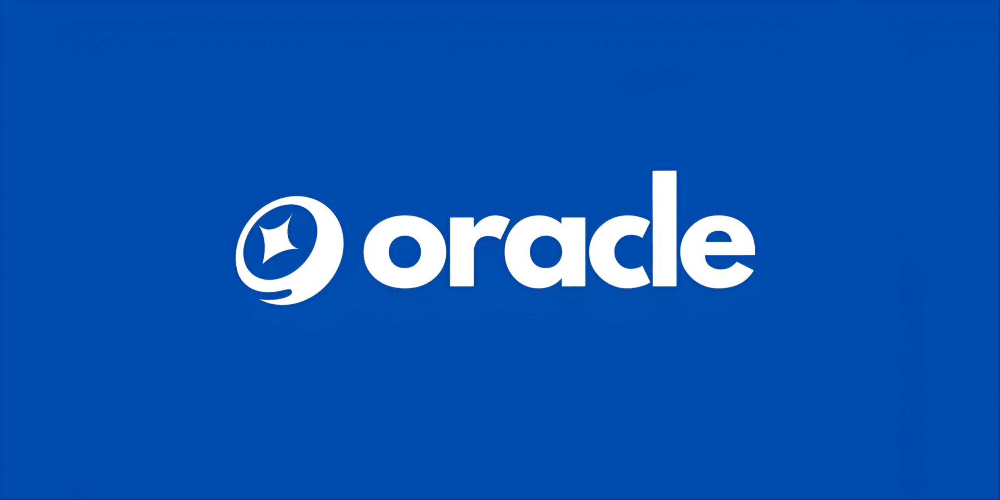

# Next Steps and Getting Involved

Now that you have a solid foundation in oracle framework, it's time to put your knowledge into practice and start building your own AI agents. Here are some next steps:

* Join the oracle framework community and engage with other developers to share ideas, ask questions, and collaborate on projects.

* Experiment with different agent personalities, behaviors, and platform integrations to explore the possibilities of AI-driven social media interactions.

* Contribute to the oracle framework codebase by submitting bug fixes, feature enhancements, or documentation improvements via pull requests on GitHub.

* Share your experiences, successes, and lessons learned with the community to inspire and help others on their oracle framework journey.

Remember, the power of oracle framework lies in its community and the collective efforts of developers like you. By actively participating and contributing, you can shape the future of AI-driven social media interactions and unlock new possibilities for engaging and empowering users across platforms. 